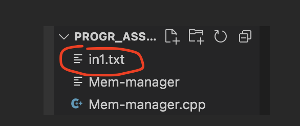
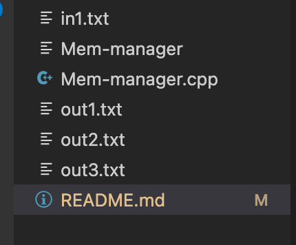

Progamming Assignment 3 

Members: Victoria Guzman 

Email: victoriaaguz@csu.fullerton.edu

Programming Lang: C++ 

How to run: 

1. Make sure that in1.txt is in the same folder 

2. In the terimal compile the program usong this" g++ -std=c++11 -o Mem-manager Mem-manager.cpp "

3. Once complied successfully run this " ./Mem-manager " 

4. It will create 3 files with the memmory manager steps. 

